# BẢN MÔ TẢ NGHIỆP VỤ & TÍNH NĂNG CHI TIẾT HỆ THỐNG SMART WMS

_(Smart Warehouse Management System - Hệ thống Quản Lý Kho Hàng Thông Minh)_

---

## 📑 MỤC LỤC

1. [TỔNG QUAN HỆ THỐNG & MÔ HÌNH KIẾN TRÚC](#1-tổng-quan-hệ-thống--mô-hình-kiến-trúc)
2. [CÁC VAI TRÒ NGƯỜI DÙNG TRONG HỆ THỐNG (ACTORS / ROLES)](#2-các-vai-trò-người-dùng-trong-hệ-thống-actors--roles)
3. [CHI TIẾT 12 PHÂN HỆ NGHIỆP VỤ & TÍNH NĂNG](#3-chi-tiết-12-phân-hệ-nghiệp-vụ--tính-năng)
   - [Phân hệ 1: Quản lý Kho Hàng & Cấu Trúc Phân Khu 5 Cấp](#phân-hệ-1-quản-lý-kho-hàng--cấu-trúc-phân-khu-5-cấp)
   - [Phân hệ 2: Quản lý Danh Mục & Dữ Liệu Nền (Master Data)](#phân-hệ-2-quản-lý-danh-mục--dữ-liệu-nền-master-data)
   - [Phân hệ 3: Nghiệp Vụ Nhập Kho Toàn Diện (Inbound Logistics)](#phân-hệ-3-nghiệp-vụ-nhập-kho-toàn-diện-inbound-logistics)
   - [Phân hệ 4: Nghiệp Vụ Xuất Kho & Phân Phối (Outbound Logistics)](#phân-hệ-4-nghiệp-vụ-xuất-kho--phân-phối-outbound-logistics)
   - [Phân hệ 5: Tồn Kho Thông Minh & Trực Quan Hóa (Smart Inventory & Visualizer)](#phân-hệ-5-tồn-kho-thông-minh--trực-quan-hóa-smart-inventory--visualizer)
   - [Phân hệ 6: Quản Lý Kiểm Kê Kho (Stocktake Management)](#phân-hệ-6-quản-lý-kiểm-kê-kho-stocktake-management)
   - [Phân hệ 7: Điều Chuyển Kho & Vận Tải (Transfer & Delivery Logistics)](#phân-hệ-7-điều-chuyển-kho--vận-tải-transfer--delivery-logistics)
   - [Phân hệ 8: Quản Lý Tài Chính, Sổ Quỹ & Thuế (Finance & VAT)](#phân-hệ-8-quản-lý-tài-chính-sổ-quỹ--thuế-finance--vat)
   - [Phân hệ 9: Cổng Thông Tin Tự Phục Vụ (E-Commerce & Portals)](#phân-hệ-9-cổng-thông-tin-tự-phục-vụ-e-commerce--portals)
   - [Phân hệ 10: Quản Lý Chứng Từ & Mẫu In (Documents & Print Templates)](#phân-hệ-10-quản-lý-chứng-từ--mẫu-in-documents--print-templates)
   - [Phân hệ 11: Hệ Thống Báo Cáo & Phân Tích Chuyên Sâu (Reporting & Analytics)](#phân-hệ-11-hệ-thống-báo-cáo--phân-tích-chuyên-sâu-reporting--analytics)
   - [Phân hệ 12: Hệ Thống, Bảo Mật, Đồng Bộ Ngoại Tuyến & Trợ Lý AI](#phân-hệ-12-hệ-thống-bảo-mật-đồng-bộ-ngoại-tuyến--trợ-lý-ai)
4. [CHI TIẾT LUỒNG HOẠT ĐỘNG CỦA TỪNG PHÂN HỆ (DETAILED MODULE WORKFLOWS)](#4-chi-tiết-luồng-hoạt-động-của-từng-phân-hệ-detailed-module-workflows)
   - [4.1. Luồng Phân hệ 1: Quản lý Kho Hàng, Thiết lập Kệ & Đóng Băng Kho](#41-luồng-phân-hệ-1-quản-lý-kho-hàng-thiết-lập-kệ--đóng-băng-kho)
   - [4.2. Luồng Phân hệ 2: Vòng Đời Sản Phẩm & Dữ Liệu Đối Tác](#42-luồng-phân-hệ-2-vòng-đời-sản-phẩm--dữ-liệu-đối-tác)
   - [4.3. Luồng Phân hệ 3: Mua Hàng, Đàm Phán Giá, Nhập Kho & AI Put-away](#43-luồng-phân-hệ-3-mua-hàng-đàm-phán-giá-nhập-kho--ai-put-away)
   - [4.4. Luồng Phân hệ 4: Xuất Bán Lẻ, B2B, Duyệt Xuất, Picking & Vận Đơn](#44-luồng-phân-hệ-4-xuất-bán-lẻ-b2b-duyệt-xuất-picking--vận-đơn)
   - [4.5. Luồng Phân hệ 5: Đồng Bộ Tồn Kho, Phân Tích ABC & Bản Đồ Nhiệt Heatmap](#45-luồng-phân-hệ-5-đồng-bộ-tồn-kho-phân-tích-abc--bản-đồ-nhiệt-heatmap)
   - [4.6. Luồng Phân hệ 6: Kế Hoạch Kiểm Kê, Quét Mã Mobile & Cân Bằng Tồn Kho](#46-luồng-phân-hệ-6-kế-hoạch-kiểm-kê-quét-mã-mobile--cân-bằng-tồn-kho)
   - [4.7. Luồng Phân hệ 7: Điều Chuyển Hàng Liên Chi Nhánh & Phân Phối Tài Xế](#47-luồng-phân-hệ-7-điều-chuyển-hàng-liên-chi-nhánh--phân-phối-tài-xế)
   - [4.8. Luồng Phân hệ 8: Thu Chi, Thu Tiền Theo Bill, Quản Lý Ngân Hàng & VAT](#48-luồng-phân-hệ-8-thu-chi-thu-tiền-theo-bill-quản-lý-ngân-hàng--vat)
   - [4.9. Luồng Phân hệ 9: Mua Hàng Online E-Shop, Cổng Khách B2B & Supplier Portal](#49-luồng-phân-hệ-9-mua-hàng-online-e-shop-cổng-khách-b2b--supplier-portal)
   - [4.10. Luồng Phân hệ 10: Tùy Biến Mẫu In & Tự Động Xuất Chứng Từ](#410-luồng-phân-hệ-10-tùy-biến-mẫu-in--tự-động-xuất-chứng-từ)
   - [4.11. Luồng Phân hệ 11: Tổng Hợp Dữ Liệu & Kết Xuất Báo Cáo Đa Chiều](#411-luồng-phân-hệ-11-tổng-hợp-dữ-liệu--kết-xuất-báo-cáo-đa-chiều)
   - [4.12. Luồng Phân hệ 12: Xác Thực RBAC, Audit Log, Ngoại Tuyến & Outbox ERP](#412-luồng-phân-hệ-12-xác-thực-rbac-audit-log-ngoại-tuyến--outbox-erp)

---

## 1. TỔNG QUAN HỆ THỐNG & MÔ HÌNH KIẾN TRÚC

**Smart WMS** là giải pháp quản lý kho hàng chuyên sâu thế hệ mới, kết hợp chặt chẽ giữa nghiệp vụ quản lý kho bãi truyền thống, thương mại điện tử đa kênh, quản lý tài chính dòng tiền và các công nghệ hiện đại như **Trực quan hóa sơ đồ kho (Digital Twin)**, **Bản đồ nhiệt (Heatmap)**, **Thuật toán gợi ý vị trí xếp hàng thông minh (AI Slotting)** cùng **Trợ lý ảo Dify AI**.

### Mô hình Ngăn xếp Công nghệ (Technology Stack)

- **Kiến trúc mã nguồn**: Monorepo tách biệt rõ ràng giữa Backend và Frontend.
- **Backend (`apps/backend`)**:
  - Framework: **NestJS** (Node.js/TypeScript), kiến trúc Module hóa (Modular Architecture) với 29+ modules nghiệp vụ.
  - Cơ sở dữ liệu & ORM: **MySQL** kết hợp **TypeORM** (hỗ trợ Migrations, Seeders và Transactions).
  - Độ tin cậy & Tích hợp: Hỗ trợ **Transactional Outbox Pattern** và **Idempotency Key** phục vụ đồng bộ dữ liệu liên tục với hệ thống ERP bên ngoài.
- **Frontend (`apps/frontend`)**:
  - Thư viện/Công nghệ: **React 18**, **TypeScript**, **Vite**, **Tailwind CSS**.
  - Định tuyến & Bảo mật: React Router v6 với phân quyền linh hoạt theo vai trò và menu (`RoleRoute`, `usePermissions`).
  - Trải nghiệm kho bãi: Giao diện tối ưu thao tác nhanh bằng phím tắt, máy quét Barcode/QR Code, hỗ trợ mô phỏng lưới Excel Matrix và Canvas 2D/3D.
  - Hỗ trợ ngoại tuyến (Offline Sync): Bộ nhớ IndexedDB lưu trữ cục bộ khi mất mạng và trang giải quyết xung đột dữ liệu (`SyncConflictsPage`).

---

## 2. CÁC VAI TRÒ NGƯỜI DÙNG TRONG HỆ THỐNG (ACTORS / ROLES)

| Vai trò (Role)                                     | Mô tả trách nhiệm & Phạm vi hoạt động                                                                                                                                                                |
| :------------------------------------------------- | :--------------------------------------------------------------------------------------------------------------------------------------------------------------------------------------------------- |
| **Quản trị viên (Admin)**                          | Toàn quyền kiểm soát hệ thống: Thiết lập người dùng, phân quyền nhóm/menu, cấu hình tham số hệ thống, cấu hình thuế, tích hợp ERP, xem nhật ký kiểm toán (Audit Log).                                |
| **Quản lý kho (Warehouse Manager)**                | Quản lý thiết lập kho bãi, phân khu, duyệt đơn mua hàng (PO), duyệt phiếu nhập/xuất kho, lập kế hoạch kiểm kê, duyệt điều chỉnh chênh lệch kho, xem toàn bộ báo cáo doanh thu, lợi nhuận và thẻ kho. |
| **Thủ kho / Nhân viên kho (Warehouse Staff)**      | Thực thi kiểm đếm tiếp nhận hàng (Receiving), cất hàng vào ô kệ (Put-away), thực hiện nhiệm vụ lấy hàng (Picking), đóng gói (Packing), quét mã kiểm kê thực tế tại ô kệ.                             |
| **Kế toán kho / Thu ngân (Accountant / Cashier)**  | Lập và duyệt các phiếu thu, phiếu chi, thu tiền theo hóa đơn bán lẻ, theo dõi công nợ khách hàng, công nợ nhà cung cấp, sổ quỹ và sao kê dòng tiền.                                                  |
| **Nhân viên giao vận / Tài xế (Shipper / Driver)** | Tiếp nhận phiếu giao hàng, lệnh điều chuyển kho liên chi nhánh, cập nhật trạng thái đơn vận chuyển (_Đang giao_, _Đã giao thành công_, _Giao thất bại_).                                             |
| **Nhà cung cấp (Supplier)**                        | Đăng nhập **Supplier Portal** để theo dõi các đơn đặt mua hàng (PO), phản hồi đàm phán giá theo vòng, cập nhật tiến độ giao hàng và danh mục sản phẩm cung cấp.                                      |
| **Khách hàng (Customer B2B / B2C)**                | Mua sắm qua cổng **E-Commerce Shop**, tra cứu tiến độ đơn đặt hàng, xem hạn mức công nợ, điểm thưởng tích lũy và lịch sử mua sắm qua **Customer Portal**.                                            |

---

## 3. CHI TIẾT 12 PHÂN HỆ NGHIỆP VỤ & TÍNH NĂNG

### Phân hệ 1: Quản lý Kho Hàng & Cấu Trúc Phân Khu 5 Cấp

- **Quản lý danh sách kho (`/warehouses`)**:
  - Quản lý đa kho vật lý (Kho tổng, Kho chi nhánh, Kho lạnh, Kho nguyên vật liệu...).
  - Trạng thái hoạt động, đóng băng kho tạm thời (`isFrozen`) khi có kiểm kê hoặc bảo trì.
  - Phân quyền Quản lý kho (`managerIds`) và Nhân viên vận hành (`staffIds`) theo từng kho riêng biệt.
- **Trang tạo mới & chỉnh sửa kho độc lập (`/warehouses/create`, `/warehouses/:id/edit`)**:
  - Không sử dụng popup chật hẹp, chuyển sang giao diện toàn màn hình trực quan với cấu hình 3 tab.
- **Cấu trúc quản lý không gian 5 cấp (WMS Standard Hierarchy)**:
  1. **Kho hàng (Warehouse)**: Đơn vị cơ sở địa lý lớn nhất.
  2. **Phân khu (Zone)**: Cấu hình điều kiện bảo quản (_Kho Lạnh -18°C ~ 5°C_, _Kho Thường 20°C ~ 30°C_, _Kho Mát/Điều hòa 15°C ~ 22°C_), kiểm soát nhiệt độ Min/Max, độ ẩm định mức và thể tích $m^3$.
  3. **Dãy kệ (Rack)**: Kích thước vật lý ($Dài \times Rộng \times Cao$), số lượng tầng trên mỗi dãy.
  4. **Tầng kệ (Shelf)**: Đánh số thứ tự tầng (Tầng 1 - sát đất chịu tải nặng, tầng cao chịu tải nhẹ).
  5. **Ngăn / Ô chứa (Bin/Cell)**: Mã định danh chuẩn **Matrix Code dạng Excel** (Ví dụ: `ZA-R01-S02-C03`), thiết lập tải trọng tối đa ($kg$), thể tích tối đa ($cm^3$), trạng thái ô (_Trống - EMPTY_, _Chứa một phần - PARTIAL_, _Đầy - FULL_, _Bảo trì - MAINTENANCE_).

---

### Phân hệ 2: Quản lý Danh Mục & Dữ Liệu Nền (Master Data)

- **Quản lý Sản phẩm & Hàng hóa (`/products/main`)**:
  - Mã SKU nội bộ (`internalSku`), mã vạch (`barcode`), tên hàng hóa, danh mục phân loại (`Category`), quy cách.
  - Quản lý nhiều mức giá: Giá bán lẻ (`price`), Giá nhập chuẩn (`importPrice`), Giá bán buôn/sỉ (`wholesalePrice`).
  - Thiết lập mức tồn kho an toàn tối thiểu (`minimumStock`) để hệ thống tự động phát cảnh báo hết hàng.
  - Quản lý album ảnh sản phẩm dạng JSON.
- **Sản phẩm theo Nhà cung cấp (`/products/supplier`)**:
  - Ánh xạ mã vạch của nhà cung cấp (`supplierBarcode`) với SKU nội bộ, ghi nhận chính sách giá nhập riêng biệt từ từng NCC.
- **Đơn vị tính (`/units`)**: Khai báo đơn vị tính chuẩn (Cái, Thùng, Hộp, Kg, Mét...) và hệ số quy đổi đơn vị phụ về đơn vị cơ bản.
- **Tiền tệ & Tỷ giá (`/currencies`)**: Hỗ trợ đa tiền tệ giao dịch và quy đổi tỷ giá hối đoái.
- **Đối tác Nhà cung cấp (`/suppliers`)**: Hồ sơ thông tin liên hệ, mã số thuế, địa chỉ, tài khoản thụ hưởng, hạn mức nợ và kỳ hạn thanh toán.
- **Đối tác Khách hàng (`/customers`)**: Hồ sơ khách hàng, phân hạng thành viên, hạn mức công nợ, số điểm tích lũy hiện có (`pointsAvailable`).
- **Khu vực / Chi nhánh (`/areas`)**: Cấu hình phân vùng địa lý, chi nhánh kinh doanh phục vụ phân tích doanh số và kho bãi.

---

### Phân hệ 3: Nghiệp Vụ Nhập Kho Toàn Diện (Inbound Logistics)

- **Đơn mua hàng từ Nhà cung cấp - PO (`/inbound/purchase-orders`)**:
  - Lập kế hoạch mua hàng, chọn nhà cung cấp, dự kiến ngày hàng về.
  - **Tính năng đặc thù - Đàm phán giá theo vòng (Price Negotiation Rounds)**: Cho phép doanh nghiệp và nhà cung cấp thương lượng giá trực tiếp trên từng dòng sản phẩm qua nhiều vòng (`rounds`) cho đến khi chốt giá cuối cùng.
  - Tính toán tự động tổng tiền hàng, chiết khấu, thuế VAT và chi phí vận chuyển.
- **Đơn nhập kho (`/inbound/stock-in-orders`, `/inbound/stock-in-orders/create`)**:
  - Khởi tạo từ PO hoặc tạo độc lập cho nhiều mục đích (Nhập hàng mua, Nhập hàng hoàn trả, Nhập tồn đầu kỳ).
  - Luồng trạng thái chuẩn: `DRAFT` (Nháp) $\rightarrow$ `IN_PROGRESS` (Đang xử lý) $\rightarrow$ `READY` (Sẵn sàng nhập) $\rightarrow$ `COMPLETED` (Hoàn thành) $\rightarrow$ `CANCELLED` (Đã hủy).
  - Ghi nhận nhân viên phụ trách từng bước (`currentStepUserId`, `currentStepUserEmail`).
- **Phiếu nhập kho thực tế (`/inbound/orders`, `/inbound/stock-in`)**:
  - Phân loại phiếu: Hàng mua (`PURCHASE_GOODS`), Thành phẩm sản xuất (`FINISHED_GOODS`), Khách trả lại (`RETURNED_GOODS`), Khác (`OTHER`).
  - Kiểm đếm số lượng thực tế nhận đối chiếu với số lượng dự kiến trên chứng từ.
  - Xác nhận phân bổ ô lưu kho (Put-away Bin) cho từng mặt hàng.
- **Phê duyệt nhập kho (`/inbound/approve`)**:
  - Cấp quản lý kiểm tra và duyệt phiếu (`POSTED`). Ngay khi được duyệt, hệ thống tự động chạy Transaction tăng số lượng tồn kho vật lý (`totalPhysical`) và tồn kho khả dụng (`available`) trong bảng `stock_balances`.
- **Hàng khách trả lại (`/inbound/return-customers`)**: Tiếp nhận hàng đổi trả từ khách hàng theo phiếu xuất hoặc đơn mua lẻ, tự động hoàn trả tồn kho và ghi nhận giảm trừ doanh thu/công nợ.
- **Yêu cầu trả hàng NCC (`/inbound/return-requests`)**: Xuất trả lại hàng cho nhà cung cấp do lỗi quy cách hoặc hàng hỏng.
- **Tạo bộ / Lắp ráp / Combo hàng hóa (`/inbound/assembly`, `/inbound/production`)**:
  - Quản lý công thức lắp ráp (BOM): Xuất linh kiện/nguyên vật liệu cấu thành để nhập kho một mặt hàng thành phẩm hoặc bộ combo mới.
  - Ghi nhận số lượng hoàn thành và quy trình kiểm đếm lại (`recountedQty`).
- **Ánh xạ mã vạch đa dạng (`/inbound/barcode-mappings`)**: Tự do liên kết mã vạch của nhà sản xuất, mã QR trên thùng hàng vào sản phẩm nội bộ để quét máy tức thì khi nhập kho.

---

### Phân hệ 4: Nghiệp Vụ Xuất Kho & Phân Phối (Outbound Logistics)

- **Đa dạng các loại chứng từ xuất kho**:
  - **Phiếu xuất bán lẻ (`/outbound/retail`)**: Xuất hàng bán trực tiếp tại quầy hoặc cho khách lẻ.
  - **Đơn đặt hàng bán buôn/B2B (`/outbound/sales-orders`)**: Quản lý các đơn đặt hàng quy mô lớn từ khách sỉ, có hạn giao và thỏa thuận thanh toán.
  - **Phiếu xuất hủy (`/outbound/disposal`)**: Xuất hủy các sản phẩm hết hạn sử dụng, hỏng hóc, đổ vỡ có biên bản lý do cụ thể.
  - **Phiếu báo giá (`/documents/quotes`)**: Soạn thảo và gửi báo giá hàng hóa chuyên nghiệp cho đối tác trước khi lên đơn xuất bán.
- **Tạo đơn xuất kho chi tiết (`/outbound/orders/create`)**:
  - Lựa chọn chi nhánh xuất, khách hàng, phương thức thanh toán (_Tiền mặt, Chuyển khoản, Công nợ_).
  - **Tích điểm & Tiêu điểm thưởng**: Cho phép sử dụng điểm tích lũy của khách hàng (`usePoints`, `pointsUsed`) để trừ trực tiếp vào giá trị đơn hàng.
  - Kiểm tra tự động số lượng khả dụng (`available`) trên hệ thống. Ngăn chặn triệt để tình trạng âm kho.
- **Phân công nhiệm vụ soạn hàng (`/outbound/task-assign`)**: Quản lý kho giao việc cho các nhân viên kho lấy hàng cụ thể theo từng đơn xuất.
- **Phê duyệt xuất kho (`/outbound/approve`)**: Quản lý phê duyệt đơn hàng. Sau khi duyệt, hệ thống tự động khóa/giữ số lượng tồn kho vào mục `allocated` để các đơn khác không lấy trùng.
- **Soạn hàng tại kho - Picking (`/outbound/picking`)**:
  - Hệ thống xuất danh sách lấy hàng (Pick List) tối ưu hóa theo thứ tự vị trí ô kệ, giúp nhân viên di chuyển quãng đường ngắn nhất.
  - Ghi nhận số lượng thực lấy (`pickedQty`) đối chiếu với số lượng yêu cầu (`requiredQty`).
- **Phiếu đóng gói & Vận đơn giao hàng - Shipping Notes (`/outbound/shipping-notes`)**:
  - Gom nhiều đơn xuất kho vào một phiếu vận đơn (`ShippingNote`) để bàn giao cho bộ phận vận chuyển.
  - Khi xuất kho hoàn tất, hệ thống trừ số lượng tồn kho vật lý (`totalPhysical`) và giải phóng số lượng giữ chỗ (`allocated`).

---

### Phân hệ 5: Tồn Kho Thông Minh & Trực Quan Hóa (Smart Inventory & Visualizer)

- **Tra cứu Tồn kho Đa chiều (`/inventory`)**:
  - Bóc tách rõ ràng 3 trạng thái số liệu tồn kho:
    - **Tồn vật lý (`totalPhysical`)**: Số lượng thực tế đang có mặt trong kho.
    - **Đang giữ chỗ (`allocated`)**: Số lượng đã được duyệt cho các đơn xuất kho hoặc lệnh chuyển hàng nhưng chưa rời khỏi kho.
    - **Khả dụng (`available`)**: $Available = TotalPhysical - Allocated$. Đây là số lượng thực sự có thể tiếp tục bán.
  - Quản lý tồn kho theo từng kho vật lý và mã vị trí ô lưu trữ chi tiết (`locationCode`).
- **Bản sao số sơ đồ kho (Digital Twin 2D/3D - `/inventory/visualizer`)**:
  - Mô phỏng trực quan toàn bộ mặt bằng kho bãi, các dãy kệ (Racks), tầng kệ (Shelves) và từng ô chứa (Bins).
  - Bấm chọn vào từng ô để xem chi tiết danh mục hàng hóa đang nằm bên trong, hạn dùng và tỷ lệ đầy/trống.
- **Bản đồ nhiệt tồn kho (Inventory Heatmap)**:
  - Hiển thị mức độ hoạt động và tần suất xuất/nhập hàng của các ô kệ bằng dải màu nhiệt (Xanh $\rightarrow$ Vàng $\rightarrow$ Đỏ).
  - Giúp thủ kho phát hiện ngay các "điểm nóng" tắc nghẽn hoặc các khu vực kệ để hoang lãng phí.
- **Thuật toán Gợi ý vị trí xếp hàng (Smart Slotting Engine - `/inventory/smart-slotting`)**:
  - **Phân tích ABC (ABC Analysis)**: Phân loại sản phẩm dựa trên tốc độ tiêu thụ và giá trị luân chuyển:
    - _Nhóm A (Fast-moving)_: Bán chạy nhất $\rightarrow$ AI gợi ý xếp ở các kệ tầng thấp (Tầng 1-2), gần lối đi chính và cửa xuất kho.
    - _Nhóm B (Medium-moving)_: Bán trung bình $\rightarrow$ Xếp ở khu vực giữa kho.
    - _Nhóm C (Slow-moving)_: Bán chậm $\rightarrow$ Xếp ở ngách sâu hoặc các tầng kệ trên cao.
  - **Công cụ gợi ý tức thì (`suggestSlotting`)**: Khi tạo đơn nhập kho, hệ thống nhận diện loại hàng, kích thước, thể tích và tải trọng để gợi ý Top 3 vị trí ô chứa tối ưu nhất chỉ trong chưa đầy 50ms.

---

### Phân hệ 6: Quản Lý Kiểm Kê Kho (Stocktake Management)

- **Lập kế hoạch & Phiếu kiểm kê (`/inventory/stocktake`, `/inventory/stocktake/create`)**:
  - Hỗ trợ kiểm kê toàn diện cả kho hoặc kiểm kê từng phần theo khu vực / kệ hàng / nhóm sản phẩm.
  - Quy định mục đích, ngày hẹn hoàn thành (`dueDate`), phân công người kiểm đếm (`checkBy`, `assignee`).
  - Đóng băng tạm thời vị trí kiểm kê để số liệu không bị biến động trong lúc đếm.
- **Nhiệm vụ kiểm kê của tôi (`/inventory/stocktake/my-tasks`)**: Giao diện riêng cho từng nhân viên kho xem danh sách các kệ hàng mình được phân công phụ trách.
- **Quét mã vạch kiểm kê trên thiết bị di động (`/inventory/stocktake/scan`)**:
  - Nhân viên cầm điện thoại hoặc máy quét cầm tay quét mã vạch sản phẩm tại từng ô kệ, nhập số lượng đếm thực tế.
  - Hệ thống hiển thị ngay số lượng chênh lệch (Thừa / Thiếu / Khớp).
- **Phê duyệt điều chỉnh tồn kho (`/inventory/stocktake/adjustment-approval`)**:
  - Cấp quản lý xem xét bảng tổng hợp chênh lệch kiểm kê kèm giải trình của nhân viên.
  - Khi bấm duyệt (`APPROVED`), hệ thống tự động sinh các bút toán điều chỉnh tăng/giảm tồn kho tương ứng và lưu vết người duyệt (`approvedBy`, `approvedAt`).
- **Phân tích rủi ro kiểm kê bằng AI (`smart-stocktake/risk-analysis`)**:
  - AI đánh giá các mặt hàng có nguy cơ thất thoát cao, sai lệch nhiều lần trong quá khứ hoặc có giá trị lớn để tự động đề xuất tạo đợt kiểm kê đột xuất (`generateRecommendedStocktake`).

---

### Phân hệ 7: Điều Chuyển Kho & Vận Tải (Transfer & Delivery Logistics)

- **Yêu cầu điều chuyển kho (`/delivery/transfer-requests`, `/delivery/create-transfer-request`)**: Chi nhánh thiếu hàng lập phiếu yêu cầu xin điều chuyển từ kho tổng hoặc chi nhánh khác.
- **Lệnh điều chuyển kho (`/delivery/transfer-orders`, `/delivery/create-transfer-order`)**:
  - Xác định kho nguồn (`sourceWarehouse`) và kho đích (`destinationWarehouse`).
  - Luồng trạng thái chuẩn: `DRAFT` $\rightarrow$ `PENDING` $\rightarrow$ `APPROVED` $\rightarrow$ `IN_TRANSIT` (Đang trên đường đi) $\rightarrow$ `DELIVERED` (Đã nhận bàn giao) $\rightarrow$ `CANCELLED`.
  - Tự động trừ tồn kho nguồn và tạo chứng từ chờ nhập ở kho đích.
- **Tiếp nhận hàng điều chuyển (`/delivery/receive-transfer-order`)**: Thủ kho đích kiểm tra số lượng thực nhận so với phiếu điều chuyển và hoàn tất nhập kho vào các ô kệ mới.
- **Quản lý đội ngũ giao vận & Tài xế (`/delivery/shippers`)**:
  - Danh bạ tài xế nội bộ và đối tác vận tải bên ngoài.
  - Ghi nhận thông tin biển số xe (`vehiclePlate`), họ tên tài xế (`driverName`), số điện thoại (`driverPhone`) phục vụ truy vết hành trình.

---

### Phân hệ 8: Quản Lý Tài Chính, Sổ Quỹ & Thuế (Finance & VAT)

- **Phiếu thu tiền (`/finance/receipts`)**: Lập phiếu thu tiền bán hàng, thu hồi nợ khách hàng, thu khác kèm phân loại dòng tiền.
- **Phiếu chi tiền (`/finance/payment-vouchers`)**: Lập phiếu chi trả tiền nhà cung cấp, chi phí vận hành kho, chi phí nhân công...
- **Thu tiền theo hóa đơn (`/finance/receipt-from-bill`)**: Cho phép kế toán chọn trực tiếp hóa đơn xuất bán để tạo phiếu thu, tự động trừ dần công nợ phải thu của khách hàng.
- **Quản lý Tài khoản Ngân hàng (`/bank-accounts`)**: Quản lý danh sách các tài khoản ngân hàng của doanh nghiệp, số dư khả dụng và lịch sử biến động tiền gửi.
- **Quản lý Thuế & Cấu hình e-VAT (`/vat/management`, `/vat/config`)**:
  - Thiết lập mức thuế suất GTGT (0%, 5%, 8%, 10%).
  - Cấu hình kết nối phát hành hóa đơn điện tử e-VAT theo chuẩn cơ quan thuế.

---

### Phân hệ 9: Cổng Thông Tin Tự Phục Vụ (E-Commerce & Portals)

- **Cửa hàng E-Commerce trực tuyến (`/shop`, `/cart`)**:
  - Khách hàng có thể truy cập xem danh mục sản phẩm, hình ảnh, giá bán lẻ và tình trạng còn hàng theo thời gian thực.
  - Thêm vào giỏ hàng, chọn số lượng, nhập thông tin giao hàng và đặt hàng trực tuyến nhanh chóng.
  - Quản lý hồ sơ mua hàng cá nhân (`/shop/profile`).
- **Cổng Khách hàng Doanh nghiệp B2B (`/customer-portal`)**:
  - Dành riêng cho khách hàng sỉ/đối tác thân thiết đăng nhập.
  - Theo dõi danh sách đơn hàng đã đặt, trạng thái chuẩn bị hàng, vận đơn đang giao.
  - Tra cứu hạn mức công nợ, số tiền còn nợ, thời hạn thanh toán và bảng đối chiếu công nợ.
- **Cổng Nhà cung cấp (`/supplier-portal`)**:
  - Nhà cung cấp trực tiếp đăng nhập để xem danh sách các đơn mua hàng (PO) doanh nghiệp gửi sang.
  - Xác nhận đơn hàng, tham gia đàm phán giá từng vòng, thông báo lịch giao hàng dự kiến (ASN).

---

### Phân hệ 10: Quản Lý Chứng Từ & Mẫu In (Documents & Print Templates)

- **Tùy biến mẫu in ấn (`/documents`, `/documents/print-templates`)**:
  - Trình thiết kế và chỉnh sửa các mẫu in biểu mẫu theo nhận diện thương hiệu của doanh nghiệp (Logo, Tiêu đề, Footer, Mã vạch).
- **Các mẫu biểu in chuyên nghiệp chuẩn WMS**:
  - Hóa đơn bán hàng kiêm phiếu giao hàng (`/documents/sales-invoice`).
  - Phiếu nhập kho hàng hóa (`/documents/stock-in-note`).
  - Phiếu xuất kho bán hàng / xuất hủy (`/documents/stock-out-note`).
  - Phiếu điều chuyển hàng hóa nội bộ (`/documents/transfer-note`).

---

### Phân hệ 11: Hệ Thống Báo Cáo & Phân Tích Chuyên Sâu (Reporting & Analytics)

Hệ thống cung cấp hơn **14 loại báo cáo chuyên sâu** hỗ trợ ra quyết định kinh doanh và điều phối kho bãi:

1. **Báo cáo Bán hàng (`/reports/sales`)**: Tổng hợp doanh số bán theo ngày, tuần, tháng và kênh phân phối.
2. **Báo cáo Doanh thu (`/reports/revenue`)**: Thống kê doanh thu thực tế sau giảm trừ chiết khấu và thuế.
3. **Báo cáo Dòng tiền (`/reports/cashflow`)**: Phân tích dòng tiền vào - ra (Inflow/Outflow) của doanh nghiệp.
4. **Báo cáo Tồn quỹ (`/reports/fund-balance`)**: Thống kê số dư tiền mặt tại quỹ và số dư các tài khoản ngân hàng.
5. **Sao kê Sổ quỹ chi tiết (`/reports/cashbook`)**: Nhật ký chi tiết mọi giao dịch thu chi phát sinh trong kỳ.
6. **Thẻ kho chi tiết (`/reports/stock-card`)**: Truy vết toàn bộ lịch sử xuất - nhập - tồn của một sản phẩm bất kỳ theo từng chứng từ phát sinh.
7. **Báo cáo Chi tiết hàng bán ra (`/reports/sales-detail`)**: Danh sách chi tiết từng mặt hàng xuất kho bán, số lượng và đơn giá.
8. **Báo cáo Doanh số theo Nhân viên (`/reports/sales-by-staff`)**: Đánh giá hiệu quả kinh doanh của từng nhân viên phụ trách đơn.
9. **Báo cáo Lợi nhuận theo Hóa đơn (`/reports/bill-profit`)**: $Lợi\_nhuận = Doanh\_thu - Giá\_vốn - Chi\_phí$ trên từng đơn hàng.
10. **Báo cáo Lợi nhuận theo Danh mục (`/reports/category-profit`)**: So sánh biên lợi nhuận giữa các nhóm ngành hàng.
11. **Báo cáo Lợi nhuận theo Khách hàng (`/reports/customer-profit`)**: Đánh giá khách hàng mang lại giá trị lợi nhuận cao nhất.
12. **Báo cáo Tồn kho Tổng hợp & Đơn vị cơ bản (`/reports/inventory`, `/reports/inventory-base-unit`)**: Bảng cân đối xuất nhập tồn toàn kho.
13. **Báo cáo Cảnh báo dưới mức tồn an toàn (`/reports/below-min-stock`)**: Danh sách mặt hàng chạm ngưỡng tồn tối thiểu cần lên đơn mua gấp.
14. **Báo cáo Hàng tồn đọng / Chậm luân chuyển (`/reports/stale-inventory`)**: Phát hiện hàng hóa lưu kho quá lâu ngày (Dead stock) để có chính sách xả kho kịp thời.
15. **Báo cáo Công nợ 2 chiều (`/reports/customer-debt`, `/reports/supplier-debt`)**: Theo dõi công nợ phải thu từ khách và công nợ phải trả nhà cung cấp.

---

### Phân hệ 12: Hệ Thống, Bảo Mật, Đồng Bộ Ngoại Tuyến & Trợ Lý AI

- **Bảo mật & Phân quyền chi tiết (RBAC)**:
  - Phân quyền 2 lớp: Phân quyền theo vai trò chính (`admin`, `manager`, `staff`, `customer`, `supplier`) và phân quyền chi tiết theo từng tính năng/menu (`menuId`).
  - Quản lý nhóm dự án (`/personnel/teams`) và nhóm quyền hạn (`/personnel/permission-groups`).
- **Nhật ký kiểm toán hệ thống (`/audit-log`)**:
  - Tự động ghi nhận mọi thao tác nhạy cảm (Tạo, Sửa, Xóa, Phê duyệt đơn hàng, Đăng nhập) kèm địa chỉ IP, thời gian và dữ liệu thay đổi trước/sau (Diff log).
- **Hỗ trợ Quét mã vạch đa nền tảng (`/scanner`)**:
  - Hỗ trợ quét qua Camera điện thoại/máy tính bảng hoặc kết nối máy quét mã vạch chuyên dụng 1D/2D không dây (Honeywell, Zebra...).
- **Khả năng hoạt động Ngoại tuyến & Giải quyết Xung đột (`/sync-conflicts`)**:
  - Khi mất kết nối Internet, nhân viên kho vẫn có thể tạo phiếu và quét hàng lưu vào bộ nhớ đệm thiết bị. Khi có mạng trở lại, hệ thống tự động đồng bộ lên server và hiển thị giao diện giải quyết xung đột nếu có tranh chấp dữ liệu.
- **Tích hợp ERP & Outbox Pattern (`/erp-status`)**:
  - Cơ chế hàng đợi sự kiện bất đồng bộ (Outbox Pattern) đảm bảo giao dịch giữa WMS và ERP (SAP, Oracle, Odoo, Fast...) không bao giờ bị mất gói tin ngay cả khi mạng chập chờn.
- **Trợ lý Ảo AI Dify (`DifyChatbot`)**:
  - Tích hợp khung chat trợ lý ảo trên toàn bộ màn hình hệ thống.
  - Hỗ trợ giải đáp nghiệp vụ kho, hướng dẫn thao tác, tra cứu thông tin nhanh chóng qua câu lệnh ngôn ngữ tự nhiên.

---

## 4. CHI TIẾT LUỒNG HOẠT ĐỘNG CỦA TỪNG PHÂN HỆ (DETAILED MODULE WORKFLOWS)

Phần này đặc tả chi tiết luồng xử lý (step-by-step), các điều kiện tiên quyết (pre-conditions), luồng dữ liệu (data flow) và kết quả đầu ra (post-conditions) của **từng phân hệ trong 12 phân hệ nghiệp vụ**.

---

### 4.1. Luồng Phân hệ 1: Quản lý Kho Hàng, Thiết lập Kệ & Đóng Băng Kho

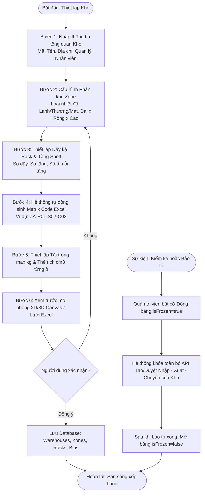

- **Mục tiêu**: Định hình cơ cấu hạ tầng kho bãi vật lý thành dữ liệu số (Digital Spatial Model).
- **Các bước thực hiện chi tiết**:
  1. **Nhập thông tin cơ bản kho**: Người dùng truy cập `/warehouses/create`, nhập Mã kho (`code`), Tên kho (`name`), Địa chỉ, chọn Quản lý kho (`managerIds`) và danh sách nhân viên kho (`staffIds`).
  2. **Cấu hình Phân khu (Zone)**: Thêm các phân khu với thuộc tính lưu trữ:
     - Kho lạnh (`COLD`): -18°C đến 5°C.
     - Kho thường (`AMBIENT`): 20°C đến 30°C.
     - Kho nhiệt/mát (`THERMAL`): 15°C đến 22°C.
     - Nhập kích thước phân khu: Chiều dài, rộng, cao (mét) $\rightarrow$ Hệ thống tự động tính thể tích tổng $m^3$.
  3. **Tạo Dãy kệ (Rack) & Ô chứa (Bin)**:
     - Nhập số lượng dãy kệ (ví dụ: 10 dãy `R01` đến `R10`).
     - Nhập số tầng trên mỗi dãy (ví dụ: 4 tầng `S01` đến `S04`).
     - Nhập số ô/ngăn trên mỗi tầng (ví dụ: 10 ô `C01` đến `C10`).
     - Hệ thống tự động chạy thuật toán sinh mã **Matrix Code Excel** đồng bộ (ví dụ: `ZA-R01-S01-C01`, `ZA-R01-S01-C02`...).
  4. **Cấu hình thông số kỹ thuật từng ô**:
     - Gán tải trọng tối đa (`maxWeightCapacity` tính bằng kg).
     - Gán thể tích tối đa (`maxVolumeCapacity` tính bằng $cm^3$).
  5. **Xem trước và Xác nhận**: Kiểm tra sơ đồ trực quan trên lưới Excel hoặc Canvas 3D Isometric, sau đó bấm **Lưu Kho Hàng**.
- **Cơ chế Đóng băng kho (`isFrozen`)**:
  - Khi kích hoạt cờ `isFrozen = true`, tất cả các API nghiệp vụ có liên quan đến việc thay đổi số lượng tồn kho của kho này (`/inbound/approve`, `/outbound/approve`, `/delivery/transfer-orders`) sẽ bị chặn với lỗi `400 Bad Request - Kho đang tạm thời đóng băng phục vụ kiểm kê/bảo trì`.

---

### 4.2. Luồng Phân hệ 2: Vòng Đời Sản Phẩm & Dữ Liệu Đối Tác

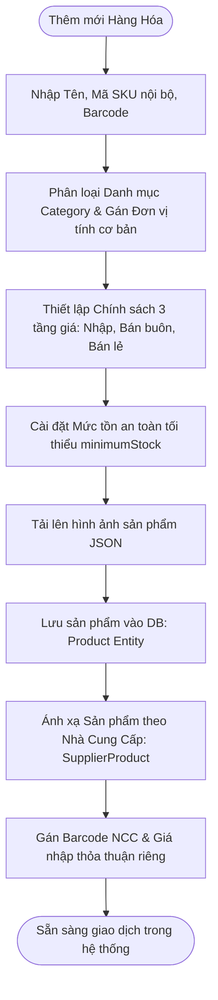

- **Các bước thực hiện chi tiết**:
  1. **Khởi tạo Hàng Hóa ([`/products/main`](file:///c:/Users/VTC/Desktop/quanlykhohang/apps/frontend/src/features/products/Products.tsx))**:
     - Điền SKU nội bộ duy nhất (`internalSku`), mã vạch (`supplierBarcode`/`barcode`).
     - Chọn Danh mục hàng hóa (`category`), Đơn vị tính cơ sở (`unit`: Cái, Thùng, Hộp...).
     - Nhập 3 mức giá: Giá vốn/nhập (`importPrice`), Giá bán buôn (`wholesalePrice`), Giá bán lẻ (`price`).
     - Cài đặt ngưỡng cảnh báo tồn kho tối thiểu (`minimumStock`).
  2. **Quản lý quy đổi Đơn vị tính ([`/units`](file:///c:/Users/VTC/Desktop/quanlykhohang/apps/frontend/src/features/products/UnitsPage.tsx))**:
     - Khai báo tỷ lệ quy đổi (Ví dụ: 1 Thùng = 24 Chai). Khi nhập theo Thùng, hệ thống tự động quy đổi số lượng tồn kho theo đơn vị cơ bản.
  3. **Ánh xạ Hàng hóa Nhà Cung Cấp ([`/products/supplier`](file:///c:/Users/VTC/Desktop/quanlykhohang/apps/frontend/src/features/supplier-products/SupplierProducts.tsx))**:
     - Một sản phẩm nội bộ có thể được cung ứng bởi nhiều NCC khác nhau với giá và mã vạch riêng. Hệ thống lưu liên kết trong bảng `supplier_products` với cặp khóa `(supplierId, productId)`.
  4. **Quản lý Hồ sơ Khách hàng & Hạn mức nợ ([`/customers`](file:///c:/Users/VTC/Desktop/quanlykhohang/apps/frontend/src/features/customers/Customers.tsx))**:
     - Thiết lập nhóm khách hàng, hạn mức công nợ tối đa, số ngày được nợ và điểm thưởng ban đầu (`pointsAvailable`).

---

### 4.3. Luồng Phân hệ 3: Mua Hàng, Đàm Phán Giá, Nhập Kho & AI Put-away

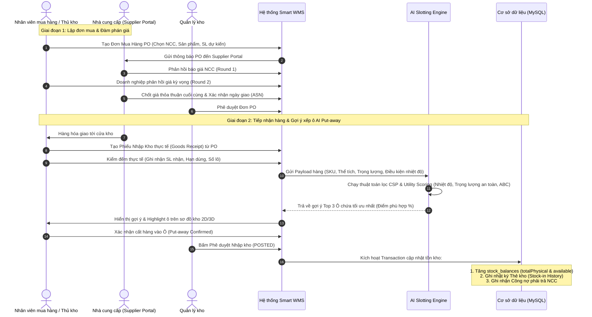

- **Điều kiện tiên quyết**: Nhà cung cấp và Sản phẩm đã tồn tại trong Master Data; Kho hàng ở trạng thái Active (không bị Freeze).
- **Các bước thực hiện chi tiết**:
  1. **Tạo Đơn mua hàng (PO)**: Nhân viên chọn NCC, nhập danh sách mặt hàng dự kiến mua, số lượng và giá dự toán.
  2. **Đàm phán giá theo vòng (Price Negotiation)**:
     - NCC đăng nhập **Supplier Portal** xem PO. Nếu không đồng ý với giá đề xuất, NCC nhập mức giá mới $\rightarrow$ Vòng 1.
     - Doanh nghiệp nhận thông báo, phản hồi chấp nhận hoặc đưa ra mức giá đối ứng $\rightarrow$ Vòng 2.
     - Khi hai bên đạt thỏa thuận, trạng thái PO chuyển thành `APPROVED`.
  3. **Tiếp nhận tại cửa kho (Receiving)**:
     - Khi xe giao hàng tới, thủ kho mở màn hình `/inbound/stock-in-orders/create` chọn PO gốc.
     - Thực hiện kiểm đếm thực tế: quét mã vạch sản phẩm, đếm số lượng, kiểm tra hạn sử dụng. Nếu thiếu/thừa/lỗi so với PO, hệ thống ghi nhận chính xác `receivedQty` vs `expectedQty`.
  4. **AI Slotting - Gợi ý vị trí xếp hàng (Put-away)**:
     - Hệ thống gửi yêu cầu tới `SmartInventoryService.suggestSlotting(productId, qty)`.
     - Thuật toán AI tính toán:
       - Lọc các ô còn trống hoặc còn thể tích/tải trọng trong phân khu có nhiệt độ tương thích.
       - Hàng nặng (> 30kg) bắt buộc xếp ở Tầng 1 hoặc 2 để đảm bảo an toàn kết cấu kệ.
       - Hàng nhóm A (bán chạy) xếp ở ô gần lối đi và cửa kho.
     - Màn hình hiển thị danh sách 3 ô tối ưu nhất (ví dụ: Ô `ZA-R01-S01-C03` - Điểm 98%). Nhân viên cất hàng vào ô và bấm xác nhận.
  5. **Duyệt phiếu nhập kho (`POSTED`)**:
     - Quản lý bấm Duyệt. Hệ thống thực thi database transaction:
       - Tăng số lượng `totalPhysical` và `available` trong bảng `stock_balances`.
       - Ghi bản ghi vào bảng `stock_in_history`.
       - Ghi nhận công nợ vào sổ theo dõi nhà cung cấp.

---

### 4.4. Luồng Phân hệ 4: Xuất Bán Lẻ, B2B, Duyệt Xuất, Picking & Vận Đơn

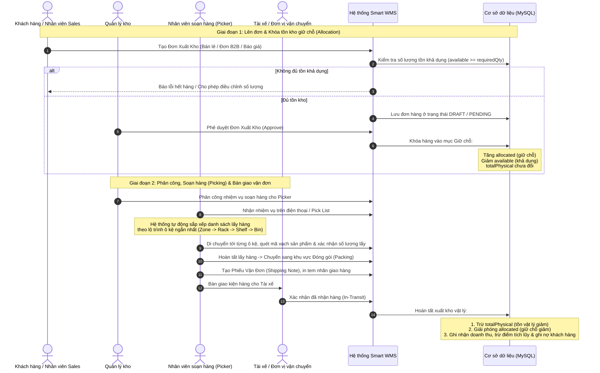

- **Các bước thực hiện chi tiết**:
  1. **Tạo Đơn xuất kho ([`/outbound/orders/create`](file:///c:/Users/VTC/Desktop/quanlykhohang/apps/frontend/src/features/outbound/pages/CreateOutboundOrderPage.tsx))**:
     - Chọn loại đơn: Bán lẻ (`retail`), Đơn B2B (`sales_order`), Xuất hủy (`disposal`).
     - Chọn khách hàng, chi nhánh xuất, phương thức thanh toán.
     - Thêm danh sách sản phẩm. Nếu khách dùng điểm thưởng tích lũy (`usePoints`), hệ thống tự động quy đổi điểm ra số tiền giảm trừ.
  2. **Kiểm tra tồn khả dụng & Duyệt đơn (`Approve`)**:
     - Hệ thống kiểm tra: Nếu $Quantity > Available$, lập tức cảnh báo không cho đặt vượt tồn.
     - Khi đơn được duyệt, hệ thống tăng `allocated` và giảm `available`. Tồn vật lý `totalPhysical` chưa bị trừ vì hàng chưa rời khỏi kệ.
  3. **Phân công nhiệm vụ soạn hàng ([`/outbound/task-assign`](file:///c:/Users/VTC/Desktop/quanlykhohang/apps/frontend/src/features/outbound/pages/TaskAssignPage.tsx))**:
     - Quản lý chỉ định nhân viên kho phụ trách đơn xuất.
  4. **Soạn hàng theo lộ trình tối ưu - Picking ([`/outbound/picking`](file:///c:/Users/VTC/Desktop/quanlykhohang/apps/frontend/src/features/outbound/pages/PickingPage.tsx))**:
     - Nhân viên mở Pick List trên thiết bị. Các mặt hàng được nhóm và sắp xếp tuần tự theo vị trí ô kệ gần nhất để nhân viên không phải đi vòng vèo nhiều lần trong kho.
     - Quét mã barcode xác nhận đã lấy đủ số lượng (`pickedQty == requiredQty`).
  5. **Đóng gói & Bàn giao Vận đơn ([`/outbound/shipping-notes`](file:///c:/Users/VTC/Desktop/quanlykhohang/apps/frontend/src/features/outbound/pages/OutboundOrderDetailPage.tsx))**:
     - Đóng gói kiện hàng, in phiếu xuất kho kiêm vận đơn (`ShippingNote`).
     - Bàn giao cho tài xế. Lúc này hệ thống chính thức trừ `totalPhysical` và giảm `allocated`, cập nhật doanh thu bán hàng và công nợ khách hàng.

---

### 4.5. Luồng Phân hệ 5: Đồng Bộ Tồn Kho, Phân Tích ABC & Bản Đồ Nhiệt Heatmap

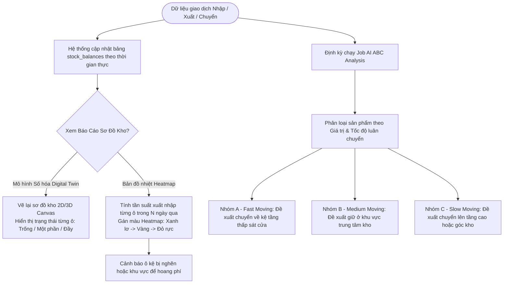

- **Các bước thực hiện chi tiết**:
  1. **Theo dõi Tồn kho Đa vị trí ([`/inventory`](file:///c:/Users/VTC/Desktop/quanlykhohang/apps/frontend/src/features/inventory/Inventory.tsx))**:
     - Mọi biến động xuất/nhập/điều chuyển được đồng bộ tức thì vào bảng `stock_balances`.
     - Cho phép tra cứu tồn kho theo mã SKU, tên hàng hóa, mã kho hoặc mã vị trí ô kệ (`locationCode`).
  2. **Bản sao số hóa Digital Twin ([`/inventory/visualizer`](file:///c:/Users/VTC/Desktop/quanlykhohang/apps/frontend/src/features/inventory/pages/WarehouseVisualizerPage.tsx))**:
     - Kết nối API `/inventory/visualizer/digital-twin` để lấy toàn bộ sơ đồ cấu trúc kho.
     - Render không gian trực quan: Người dùng click chuột vào từng ô kệ để xem chi tiết: Tên sản phẩm đang chứa, số lượng, trọng lượng hiện tại so với tải trọng tối đa, tỷ lệ lấp đầy thể tích.
  3. **Bản đồ nhiệt Heatmap**:
     - API `/inventory/visualizer/heatmap?days=30` thống kê tổng số lượt lấy/cất hàng tại từng ô trong 30 ngày gần nhất.
     - Màu xanh lá: Tần suất thấp ($< 5$ lượt/tháng).
     - Màu vàng/cam: Tần suất trung bình ($5 - 30$ lượt/tháng).
     - Màu đỏ rực: Tần suất cực cao ($> 30$ lượt/tháng) $\rightarrow$ Thủ kho cần đảm bảo lối đi xung quanh ô này luôn thông thoáng.
  4. **Thuật toán Phân tích ABC (`abc-analysis`)**:
     - Tự động tính toán tỷ lệ đóng góp doanh số và số lần xuất hàng của từng SKU.
     - Gợi ý thủ kho tái cấu trúc lại vị trí hàng trong kho (Reslotting) để tăng tốc độ soạn hàng lên đến 35%.

---

### 4.6. Luồng Phân hệ 6: Kế Hoạch Kiểm Kê, Quét Mã Mobile & Cân Bằng Tồn Kho

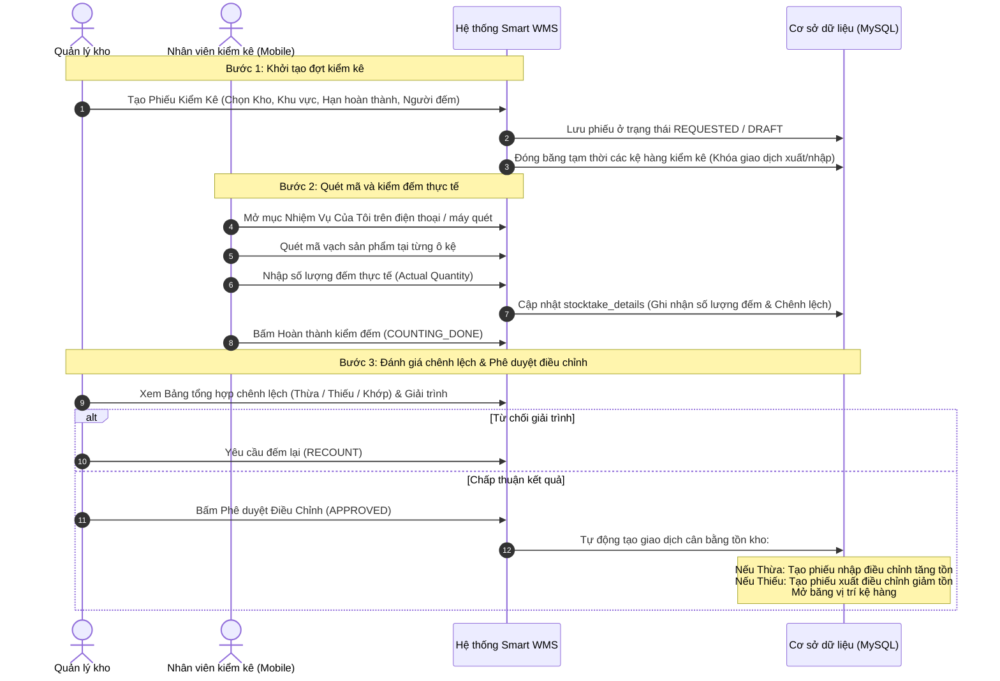

- **Các bước thực hiện chi tiết**:
  1. **Lập phiếu kiểm kê ([`/inventory/stocktake/create`](file:///c:/Users/VTC/Desktop/quanlykhohang/apps/frontend/src/features/inventory/pages/CreateStocktakeOrderPage.tsx))**:
     - Chọn kho kiểm kê, phạm vi (Toàn kho hoặc một số dãy kệ cụ thể), ngày hẹn hoàn thành (`dueDate`), phân công nhân viên chịu trách nhiệm (`assignee`).
  2. **Thực thi kiểm đếm di động ([`/inventory/stocktake/scan`](file:///c:/Users/VTC/Desktop/quanlykhohang/apps/frontend/src/features/inventory/pages/StocktakeScanPage.tsx))**:
     - Nhân viên sử dụng camera điện thoại hoặc máy quét mã vạch đi dọc theo từng kệ hàng.
     - Quét mã vạch sản phẩm $\rightarrow$ Hệ thống hiển thị thông tin sản phẩm $\rightarrow$ Nhập số lượng thực đếm.
     - Hệ thống tự động so sánh với số liệu trên sổ sách:
       $$\text{Chênh lệch (Difference)} = \text{Số thực đếm} - \text{Số sổ sách}$$
  3. **Phê duyệt điều chỉnh tồn kho ([`/inventory/stocktake/adjustment-approval`](file:///c:/Users/VTC/Desktop/quanlykhohang/apps/frontend/src/features/inventory/pages/AdjustmentApprovalPage.tsx))**:
     - Quản lý kiểm tra các dòng sản phẩm bị lệch số lượng.
     - Khi bấm `APPROVED`, hệ thống thực hiện transaction cập nhật lại `totalPhysical` và `available` trong `stock_balances` theo đúng số thực tế, đồng thời ghi nhận vào sổ theo dõi hao hụt/thất thoát.

---

### 4.7. Luồng Phân hệ 7: Điều Chuyển Hàng Liên Chi Nhánh & Phân Phối Tài Xế

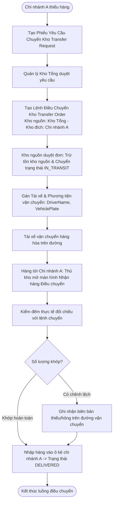

- **Các bước thực hiện chi tiết**:
  1. **Yêu cầu điều chuyển ([`/delivery/transfer-requests`](file:///c:/Users/VTC/Desktop/quanlykhohang/apps/frontend/src/features/delivery/pages/TransferRequestsPage.tsx))**: Chi nhánh nhận lập phiếu đề xuất danh sách mặt hàng và số lượng cần điều chuyển từ kho cấp trên.
  2. **Tạo Lệnh điều chuyển ([`/delivery/create-transfer-order`](file:///c:/Users/VTC/Desktop/quanlykhohang/apps/frontend/src/features/delivery/pages/CreateTransferOrderPage.tsx))**:
     - Thiết lập kho nguồn (`sourceWarehouse`), kho đích (`destinationWarehouse`), ngày chuyển dự kiến.
     - Trạng thái khởi tạo: `DRAFT` $\rightarrow$ `PENDING`.
  3. **Xuất kho chuyển hàng & Phân công tài xế**:
     - Kho nguồn duyệt lệnh (`APPROVED`), thủ kho nguồn xuất hàng giao cho tài xế.
     - Ghi nhận thông tin tài xế từ danh mục Shipper (`/delivery/shippers`): Họ tên, số điện thoại, biển số xe.
     - Đơn chuyển sang trạng thái `IN_TRANSIT`. Hệ thống trừ tồn kho tại kho nguồn.
  4. **Tiếp nhận tại kho đích ([`/delivery/receive-transfer-order`](file:///c:/Users/VTC/Desktop/quanlykhohang/apps/frontend/src/features/delivery/pages/CreateTransferOrderPage.tsx))**:
     - Thủ kho đích kiểm đếm số lượng thực nhận, gắn vị trí ô kệ lưu kho mới.
     - Xác nhận hoàn tất, đơn chuyển sang trạng thái `DELIVERED`, tồn kho tại chi nhánh nhận tự động tăng lên.

---

### 4.8. Luồng Phân hệ 8: Thu Chi, Thu Tiền Theo Bill, Quản Lý Ngân Hàng & VAT

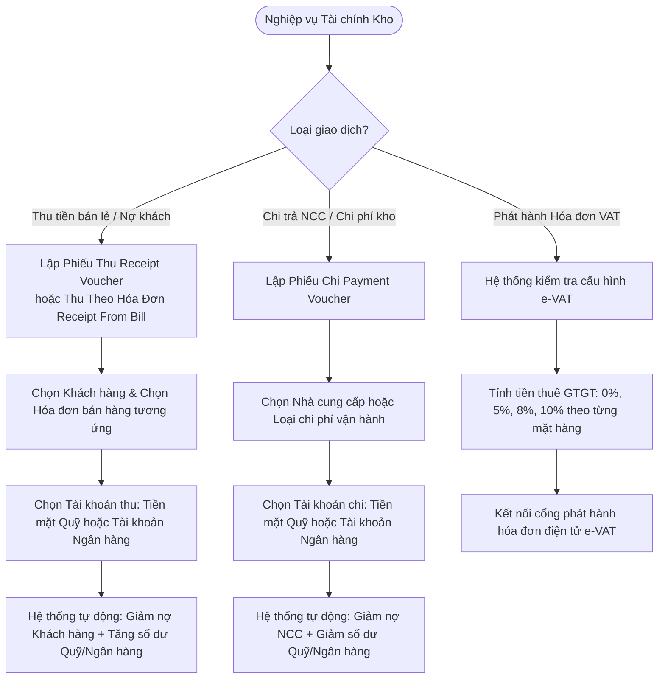

- **Các bước thực hiện chi tiết**:
  1. **Thu tiền theo hóa đơn ([`/finance/receipt-from-bill`](file:///c:/Users/VTC/Desktop/quanlykhohang/apps/frontend/src/features/finance/pages/ReceiptFromBillPage.tsx))**:
     - Thu ngân/kế toán chọn khách hàng $\rightarrow$ Hệ thống tự động tải danh sách các hóa đơn bán hàng còn nợ tiền (`debt > 0`).
     - Nhập số tiền thu thực tế $\rightarrow$ Hệ thống trừ dần công nợ theo nguyên tắc hóa đơn cũ thu trước (FIFO).
  2. **Lập phiếu thu / chi thông thường ([`/finance/receipts`](file:///c:/Users/VTC/Desktop/quanlykhohang/apps/frontend/src/features/finance/pages/ReceiptVouchersPage.tsx), [`/finance/payment-vouchers`](file:///c:/Users/VTC/Desktop/quanlykhohang/apps/frontend/src/features/finance/pages/PaymentVouchersPage.tsx))**:
     - Nhập người nộp/người nhận, lý do, số tiền, hình thức thanh toán.
     - Nếu chọn thanh toán chuyển khoản, chọn tài khoản nhận tiền trong danh mục Tài khoản Ngân hàng (`/bank-accounts`).
  3. **Quản lý Thuế & e-VAT ([`/vat/management`](file:///c:/Users/VTC/Desktop/quanlykhohang/apps/frontend/src/features/vat/pages/VatManagementPage.tsx))**:
     - Tự động bóc tách doanh thu chưa thuế, tiền thuế VAT và tổng thanh toán trên mỗi chứng từ xuất/nhập, chuẩn bị dữ liệu gửi cơ quan thuế.

---

### 4.9. Luồng Phân hệ 9: Mua Hàng Online E-Shop, Cổng Khách B2B & Supplier Portal

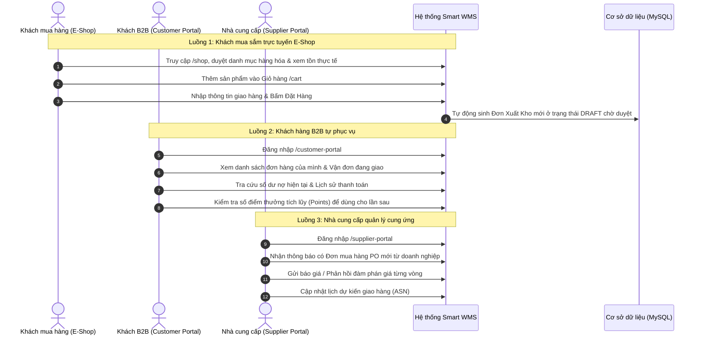

- **Các bước thực hiện chi tiết**:
  1. **Mua hàng E-Shop ([`/shop`](file:///c:/Users/VTC/Desktop/quanlykhohang/apps/frontend/src/features/shop/Shop.tsx))**: Cho phép khách hàng lẻ xem sản phẩm có hình ảnh, giá bán và trạng thái còn hàng. Đơn đặt hàng từ Shop được đồng bộ thẳng vào hàng đợi đơn xuất kho của WMS để nhân viên xử lý.
  2. **Customer Portal ([`/customer-portal`](file:///c:/Users/VTC/Desktop/quanlykhohang/apps/frontend/src/features/customer-portal/pages/CustomerPortalPage.tsx))**: Khách sỉ theo dõi độc lập các thông tin: Đơn hàng đang xử lý, công nợ lũy kế, hạn mức nợ còn lại, điểm thưởng khả dụng.
  3. **Supplier Portal ([`/supplier-portal`](file:///c:/Users/VTC/Desktop/quanlykhohang/apps/frontend/src/features/supplier-portal/pages/SupplierProfilePage.tsx))**: Nhà cung cấp tương tác trực tiếp với bộ phận thu mua của doanh nghiệp mà không cần dùng email/điện thoại thủ công, giảm 80% thời gian xử lý đơn mua hàng.

---

### 4.10. Luồng Phân hệ 10: Tùy Biến Mẫu In & Tự Động Xuất Chứng Từ

```mermaid
flowchart TD
    A([Người dùng truy cập Quản lý Mẫu in /documents]) --> B[Chọn loại chứng từ cần cấu hình: Hóa đơn, Phiếu nhập, Phiếu xuất, Phiếu chuyển]
    B --> C[Mở Trình chỉnh sửa Template Editor]
    C --> D[Tùy biến Logo công ty, Tiêu đề, Footer, Font chữ, Khổ giấy A4/A5/K80]
    D --> E[Chèn các tham số động: {{orderNo}}, {{customerName}}, {{totalAmount}}, {{barcode}}]
    E --> F[Bấm Xem trước Preview chứng từ mẫu]
    F --> G{Đạt yêu cầu?}
    G -- Chưa đạt --> D
    G -- Đồng ý --> H[Lưu mẫu in vào CSDL]
    H --> I[Khi nhân viên thao tác Xuất/Nhập/Chuyển kho: Bấm In Phiếu]
    I --> J[Hệ thống tự động điền dữ liệu động vào mẫu và xuất lệnh In/PDF]
```

- **Các bước thực hiện chi tiết**:
  1. **Thiết lập mẫu in ([`/documents/print-templates`](file:///c:/Users/VTC/Desktop/quanlykhohang/apps/frontend/src/features/documents/pages/PrintTemplatesPage.tsx))**: Quản trị viên tùy chỉnh giao diện mẫu in cho 4 loại chứng từ cốt lõi: Hóa đơn bán lẻ, Phiếu nhập kho, Phiếu xuất kho, Phiếu điều chuyển kho.
  2. **Chèn mã vạch tự động**: Mẫu in phiếu kho tự động render Barcode/QR Code của mã phiếu để nhân viên kho chỉ cần cầm máy quét bắn vào phiếu là mở ngay đơn hàng trên màn hình.

---

### 4.11. Luồng Phân hệ 11: Tổng Hợp Dữ Liệu & Kết Xuất Báo Cáo Đa Chiều

```mermaid
flowchart TD
    A([Kho Dữ Liệu Giao Dịch]) --> B[Engine Tính Toán Báo Cáo Reports Service]

    B --> C[Nhóm Báo Cáo Doanh Thu & Bán Hàng<br/>Doanh số theo Ngày/Tháng, Theo Nhân viên, Chi tiết mặt hàng]
    B --> D[Nhóm Báo Cáo Lợi Nhuận 3 Cấp<br/>Theo Hóa đơn, Theo Danh mục, Theo Khách hàng]
    B --> E[Nhóm Báo Cáo Kho Vận<br/>Thẻ kho chi tiết, Tồn kho tổng hợp, Tồn kho đơn vị chuẩn]
    B --> F[Nhóm Báo Cáo Cảnh Báo Sớm<br/>Tồn dưới mức an toàn, Hàng tồn đọng Dead-stock]
    B --> G[Nhóm Báo Cáo Dòng Tiền & Công Nợ<br/>Sổ quỹ, Tồn quỹ, Nợ phải thu Khách, Nợ phải trả NCC]

    C & D & E & F & G --> H[Hiển thị Giao diện Bảng dữ liệu đa năng + Biểu đồ trực quan]
    H --> I[Bộ lọc thời gian, chi nhánh, kho, khách hàng, ngành hàng]
    I --> J[Kết xuất dữ liệu: Xuất file Excel .xlsx hoặc PDF]
```

- **Các bước thực hiện chi tiết**:
  1. **Báo cáo Lợi nhuận 3 cấp**:
     - Cấp 1 - Theo Hóa đơn (`/reports/bill-profit`): Xem biên lợi nhuận của từng đơn bán.
     - Cấp 2 - Theo Danh mục (`/reports/category-profit`): Xác định nhóm hàng mang lại lợi nhuận cao nhất.
     - Cấp 3 - Theo Khách hàng (`/reports/customer-profit`): Nhận diện khách hàng VIP tạo ra giá trị thặng dư lớn nhất.
  2. **Báo cáo Cảnh báo tồn an toàn (`/reports/below-min-stock`)**:
     - Quét toàn bộ kho, lọc ra các mặt hàng có:
       $$\text{Available} \le \text{minimumStock}$$
     - Cung cấp nút bấm nhanh "Tạo Đơn Mua Hàng PO" ngay trên giao diện báo cáo.
  3. **Báo cáo Hàng tồn đọng (`/reports/stale-inventory`)**:
     - Lọc các lô hàng lưu kho trên 60/90/180 ngày không có giao dịch xuất, giúp ban quản trị ra quyết định xả hàng, khuyến mãi thu hồi vốn.

---

### 4.12. Luồng Phân hệ 12: Xác Thực RBAC, Audit Log, Ngoại Tuyến & Outbox ERP

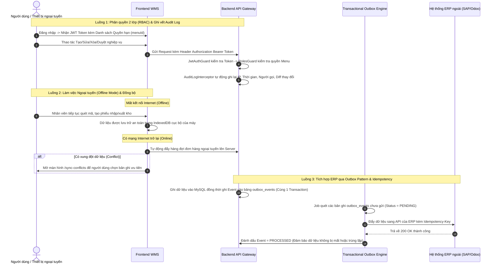

- **Các bước thực hiện chi tiết**:
  1. **Phân quyền 2 lớp**:
     - Lớp 1: Vai trò chính (`Admin`, `Manager`, `Staff`, `Customer`, `Supplier`).
     - Lớp 2: Danh sách mã quyền menu (`menuId` - ví dụ: `inbound-stock-in-orders`, `inventory-stocktake`...). Người dùng chỉ nhìn thấy và bấm được các nút chức năng mà mình được phân quyền.
  2. **Audit Log tự động ([`/audit-log`](file:///c:/Users/VTC/Desktop/quanlykhohang/apps/frontend/src/features/audit-log/AuditLog.tsx))**:
     - Mọi thay đổi dữ liệu nhạy cảm đều được ghi nhận vào bảng `audit_logs` gồm: ID người dùng, hành động, bảng dữ liệu bị tác động, giá trị trước khi sửa và giá trị sau khi sửa.
  3. **Hoạt động Ngoại tuyến & Giải quyết Xung đột ([`/sync-conflicts`](file:///c:/Users/VTC/Desktop/quanlykhohang/apps/frontend/src/features/offline-sync/pages/SyncConflictsPage.tsx))**:
     - Đảm bảo nhân viên kho làm việc liên tục ngay cả trong góc kho sóng wifi yếu. Khi tái kết nối, nếu cùng một ô kệ bị thay đổi bởi 2 nhân viên khác nhau, màn hình giải quyết xung đột sẽ hiển thị rõ 2 phiên bản để thủ kho chọn phiên bản chính xác.
  4. **Tích hợp ERP an toàn ([`/erp-status`](file:///c:/Users/VTC/Desktop/quanlykhohang/apps/frontend/src/features/erp-status/pages/ErpSyncStatusPage.tsx))**:
     - Áp dụng mô hình **Transactional Outbox Pattern** kết hợp **Idempotency Key**. Ngay cả khi server bị khởi động lại đột ngột hoặc mạng ERP bị nghẽn, thông điệp tích hợp vẫn nằm an toàn trong hàng đợi cơ sở dữ liệu và sẽ được tự động gửi lại ngay khi hệ thống phục hồi, ngăn ngừa hoàn toàn rủi ro sai lệch dữ liệu tài chính kho giữa WMS và ERP.

---

_Tài liệu này được biên soạn và chuẩn hóa toàn diện dựa trên mã nguồn thực tế của hệ thống Smart WMS._
